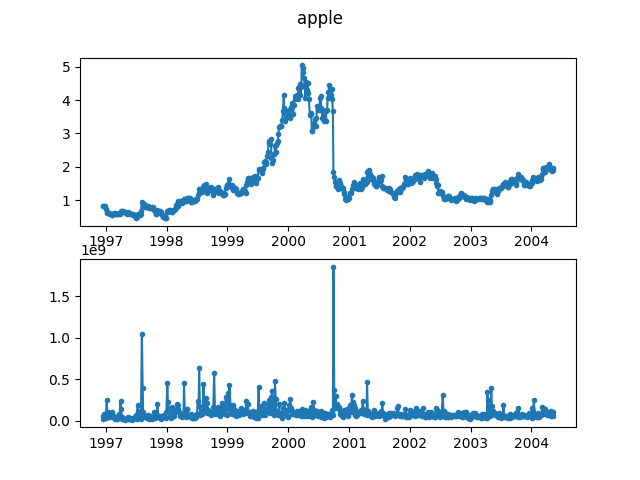

# Apple Stock

This dataset concerns the daily close price and volume of Apple stock around 
the year 2000. The dataset is sampled every 3 observations to reduce the 
length of the time series.

Data retrieved from [Yahoo 
Finance](https://finance.yahoo.com/quote/AAPL/history?period1=850348800&period2=1084579200&interval=1d&filter=history&frequency=1d). 
We use the Python package ``yfinance`` to download the data as it can not be 
redistributed as part of this repository.

Since the original data has observations only on trading days, there are 
arguably gaps in this time series on non-trading days. However we consider 
these to be consecutive, and thus also consider the sampled time series to 
have consecutive observations.

