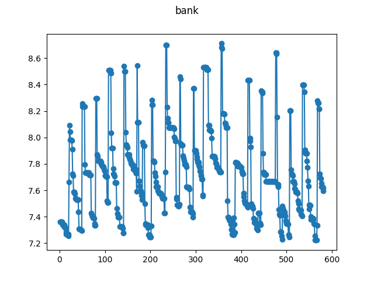

# Bank amounts

This dataset represents the amount of money in someone's current account. 
Significant changes occur on days of large transactions.

The ``bank.json`` file and this readme are licensed under the MIT license, see 
the LICENSE file.

