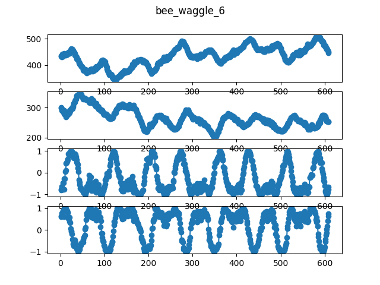

# Bee Waggle Dataset sequence 6

The movement of honey bees switches between a left turn, a right turn, and a 
waggle.  This dataset contains is a three-dimensional dataset of the position 
(x, y) and heading angle (theta) of a single bee.

Source: [Parametric Segmental Switching Linear Dynamic Systems 
(PS-SLDS)](https://www.cc.gatech.edu/~borg/ijcv_psslds/).

When using this time series, please cite original authors:

```bibtex
@article{oh2008learning,
    title={Learning and inferring motion patterns using parametric segmental switching linear dynamic systems},
    author={Oh, S. M. and Rehg, J. M. and Balch, T. and Dellaert, F.},
    journal={International Journal of Computer Vision},
    volume={77},
    number={1-3},
    pages={103--124},
    year={2008},
    publisher={Springer}
}
```


