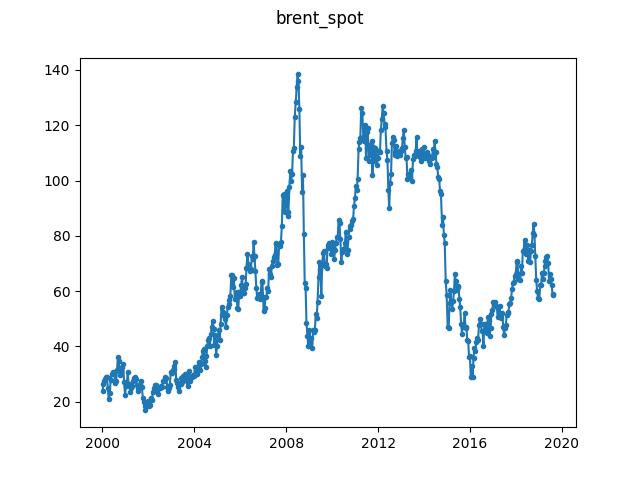

# Brent Spot Price

This is the USD price for Brent Crude oil, measured daily. We include the time 
series from 2000 onwards. The data is sampled at every 10 original 
observations to reduce the length of the series.

The data is obtained from the [U.S. Energy Information 
Administration](https://www.eia.gov/opendata/qb.php?sdid=PET.RBRTE.D). Since 
the data is in the public domain, we distribute it as part of this repository. 
Source: U.S. Energy Information Administration (Sep. 2019).

Since the original data has observations only on trading days, there are 
arguably gaps in this time series (on non-trading days). However we consider 
these to be consecutive, and thus also consider the sampled time series to 
have consecutive observations.

To obtain the ``brent_spot.json`` file from the original 
``Europe_Brent_Spot_Price_FOB_Daily.csv`` file, simply run:

```
$ python convert.py Europe_Brent_Spot_Price_FOB_Daily.csv brent_spot.json
```


