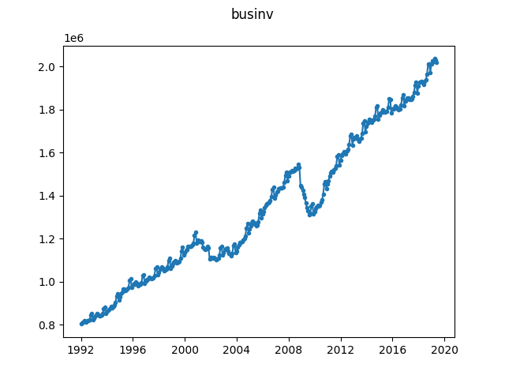

# Total Business Inventories

Monthly total business inventories from the US Census. Data retrieved from 
[this direct 
url](https://www.census.gov/mtis/www/data/text/mtis-inventory.txt) on 
2019-09-11. We use the unadjusted time series to maintain the seasonal 
component.

According to [this 
page](https://web.archive.org/web/20191120160410/https://ask.census.gov/prweb/PRServletCustom/YACFBFye-rFIz_FoGtyvDRUGg1Uzu5Mn*/!STANDARD?pyActivity=pyMobileSnapStart&ArticleID=KCP-4726) 
on the US Census website, we are allowed to redistribute the data as part of 
this repository.

Source: United States Census Bureau, URL: https://www.census.gov, Retrieved: 
2019-09-11.

To create the ``businv.json`` file from the raw ``mtis-inventory.txt`` file, 
simply run:

```
$ python convert.py mtis-inventory.txt businv.json
```


