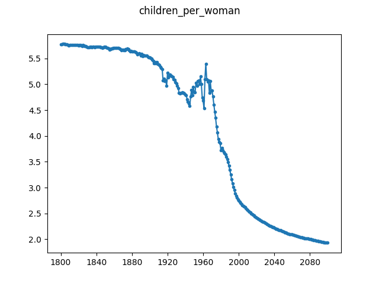

# Children per Woman

This is a dataset from GapMinder showing the number of children per woman on 
average, globally.

The original data is obtained from GapMinder at: 
[https://www.gapminder.org/data/documentation/gd008/](https://www.gapminder.org/data/documentation/gd008/)

The timeseries that we use is from the ``world_total`` tab in the XLSX file.

GapMinder data is licensed under the CC BY 4.0 license, which allows us to 
redistribute the original xlsx file here. Attribution: Free data from 
www.gapminder.org.

