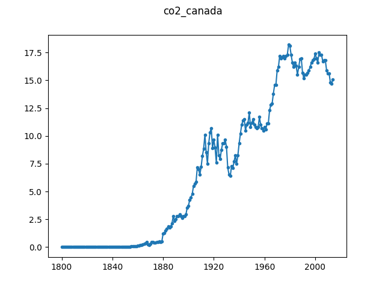

# CO2 emissions (tonnes per person) for Canada

This series describes carbon dioxide emissions from the burning of fossil 
fuels (metric tonnes of CO2 per person) in Canada. The data is retrieved from 
[GapMinder](https://www.gapminder.org/tools/#$state$marker$axis_y$which=co2_emissions_tonnes_per_person&domainMin:null&domainMax:null&zoomedMin:null&zoomedMax:null&scaleType=genericLog&spaceRef:null;;;&chart-type=bubbles)

We isolate Canada because there is a long history and the behaviour looks 
interesting.

GapMinder data is licensed under the CC BY 4.0 license, which allows us to 
redistribute the original data here. Attribution: Free data from 
www.gapminder.org.

