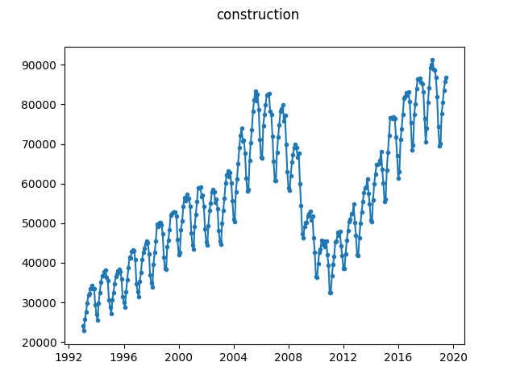

# Total Private Construction Spending

This dataset is retrieved from the US Census and concerns the total private 
construction spending. Potential change points occur at recessions. The data 
is obtained [from this Census 
page](https://www.census.gov/construction/c30/historical_data.html) using the 
"Private" series from the "Not Seasonally Adjusted" column in the "Monthly" 
table. Alternatively, use [this direct 
URL](https://www.census.gov/construction/c30/xls/privtime.xls).

According to [this 
page](https://web.archive.org/web/20191120160410/https://ask.census.gov/prweb/PRServletCustom/YACFBFye-rFIz_FoGtyvDRUGg1Uzu5Mn*/!STANDARD?pyActivity=pyMobileSnapStart&ArticleID=KCP-4726) 
on the US Census website, we are allowed to redistribute the data as part of 
this repository.

Source: United States Census Bureau, URL: https://www.census.gov, Retrieved: 
2019-09-11.

To create ``construction.json`` file from the raw ``privtime.xls`` file, 
simply run:

```
$ python convert.py privtime.xls construction.json
```


