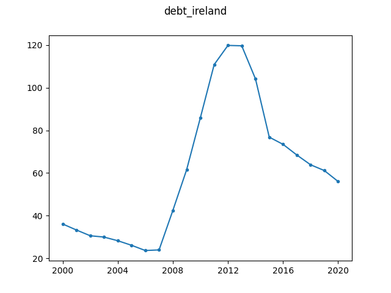

# Debt of Ireland

Data obtained from 
[Eurostat](https://www.euro-area-statistics.org/macro-economic-indicators?cr=aut&lg=en&page=2&template=1).

Specifically, the timeseries concerns the government debt ratio of Ireland for 
the period 2000-2020. Effects of the financial crisis are visible.

Source: euro area statistics.
Retrieved: 2019-03-27.

The information page of the Euro Area Statistics website states that data can 
be redistributed under the condition that the source is quoted.

