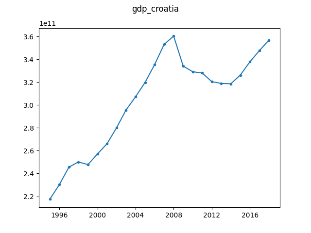

# GDP Croatia in constant LCU

Apparent change point around the financial crisis. Obtained from the [World 
Bank](https://data.worldbank.org/indicator/NY.GDP.MKTP.KN?end=2018&locations=HR&start=1995).

The dataset is licensed under the CC-BY 4.0 license. Data retrieved from the 
World Bank on 2019-08-28. No modifications to the original data file 
(``API_NY.GDP.MKTP.KN_DS2_en_csv_v2_126181.csv``) have been made.

To retrieve the ``gdp_croatia.json`` file from the csv file, simply run:

```
$ python convert.py ./API_NY.GDP.MKTP.KN_DS2_en_csv_v2_126181.csv ./gdp_croatia.json
```


