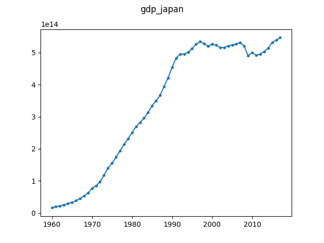

# Historic GDP of Japan in the Local Currency Unit (LCU)

Data obtained from the [World 
Bank](https://data.worldbank.org/indicator/NY.GDP.MKTP.CN?locations=JP).

There is a known structural break in the growth rate of Japan, known as the 
[lost decade](https://en.wikipedia.org/wiki/Lost_Decade_(Japan)).

The dataset is licensed under the CC-BY 4.0 license. Data retrieved from the 
World Bank on 2019-03-27. No modifications to the original data file 
(``gdp.csv``) have been made. The file ``gdp_japan.csv`` is a subset of the 
``gdp.csv`` file that contains only the data for Japan. The ``gdp_japan.json`` 
file is manually constructed from the ``gdp_japan.csv`` file.

