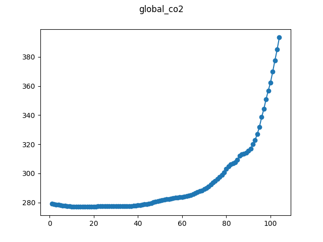

# Global Monthly CO2 levels

This dataset concerns monthly global hemispheric means of carbon dioxide in 
air. The data is part of the CMIP6 dataset, developed by Meinshausen et al. 

When using this data, please cite:

```bib
@article{meinshausen2017historical,
	title={Historical greenhouse gas concentrations for climate modelling ({CMIP6})},
	author={Meinshausen, M. and Vogel, E. and Nauels, A. and Lorbacher, K. and Meinshausen, N. and Etheridge, D. M. and Fraser, P. J. and Montzka, S. A. and Rayner, P. J. and Trudinger, C. M. and Krummel, P. B. and Beyerle, U. and Canadell, J. G. and Daniel, J. S. and Enting, I. G. and Law, R. M. and Lunder, C. R. and O'Doherty, S. and Prinn, R. G. and Reimann, S. and Rubino, M. and Velders, G. J. M. and Vollmer, M. K. and Wang, R. H. J. and Weiss, R.},
	journal={Geoscientific Model Development},
	volume={10},
	pages={2057--2116},
	year={2017},
	publisher={Copernicus}
}
```

It seems that the work of Meinshausen et al. is licensed under [CC BY 
3.0](https://creativecommons.org/licenses/by/3.0/), judging from [the 
publication](https://www.geosci-model-dev.net/10/2057/2017/). This allows us 
to redistribute this time series as part of the dataset, provided that the 
above source is cited. We thus include the source csv in the repository.

Note that the original data is sampled every 4 years and cropped to recent 
history to reduce the length of the series.


