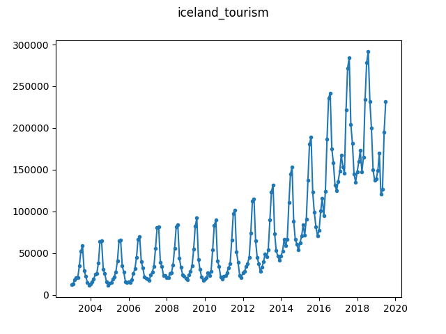

# Iceland Tourism numbers by Month

Source [Icelandic Tourist 
Board](https://www.ferdamalastofa.is/en/recearch-and-statistics/numbers-of-foreign-visitors).

This dataset contains the monthly visitor numbers of tourists to Iceland, 
arriving through Keflavik airport. The data is obtained from the Icelandic 
Tourist Board. Since it is unclear if the data is in the public domain, we 
download it from an archive.org URL and do not redistribute it as part of this 
repository.

