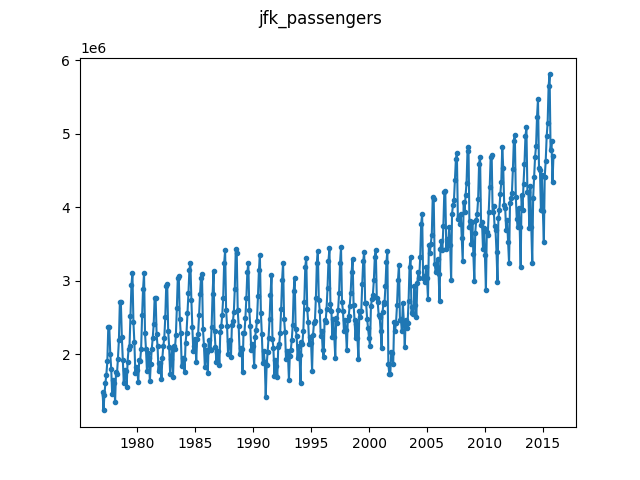

# JFK Airline Passengers

This dataset gives the number of passengers arriving and departing at JFK. 

The data is obtained from New York State's official Kaggle page for this 
dataset: https://www.kaggle.com/new-york-state/nys-air-passenger-traffic,-port-authority-of-ny-nj#air-passenger-traffic-per-month-port-authority-of-ny-nj-beginning-1977.csv

This page shows that the data is under a "CC0: Public Domain" license, so we 
redistribute it here as part of our repository.

To create the ``jfk_passengers.json`` file from the raw csv file, simply run:

```
$ python convert.py ./air-passenger-traffic-per-month-port-authority-of-ny-nj-beginning-1977.csv ./jfk_passengers.json
```


