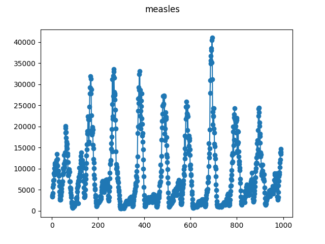

# Weekly Measles Case Reports England & Wales

This data is available from [prof. Ben Bolker's 
webpage](https://ms.mcmaster.ca/~bolker/measdata.html).

The original file is ``ewmeas.dat``.

For the data format, see: 
[https://ms.mcmaster.ca/~bolker/measdata/formats.html](https://ms.mcmaster.ca/~bolker/measdata/formats.html).

The time difference between observations is not exactly constant, but for the 
annotation we will consider it as such. Detection algorithms that can take a 
specific time axis should be provided with the true axis.

While this data is provided "as is", it is not clearly licensed for 
redistribution. We therefore download it locally instead of distributing it 
with this repository.

