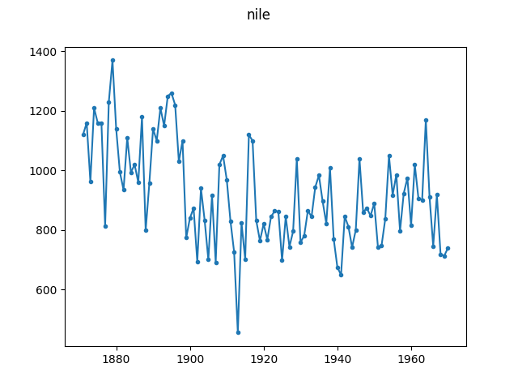

# Volume of Nile River at Aswan

This is a dataset on the volume of the Nile river at Aswan for the period 
1871-1970. The data is obtained from the website of the book [Time Series 
Analysis by State Space Methods](http://www.ssfpack.com/DKbook.html) by Durbin 
and Koopman. The data is also available in the R ``datasets`` package, which 
is part of R and is therefore licensed under version 2 of the [GNU Public 
License](https://www.r-project.org/COPYING). The data file produced from this 
data (``nile.json``) is therefore licensed under GPLv2 as well.

A potential change point occurs in 1898 with the introduction of a dam.

Note that this is not the Nile dataset used in other change point papers, 
which covers a period from 622 to 1284 AD (see e.g. Witcher et al. (2002)).
That dataset, [available 
here](https://web.archive.org/web/20000815223740/http://lib.stat.cmu.edu/S/beran), 
has been used in many papers to detect the introduction of a nilometer in the 
year 715 AD.

