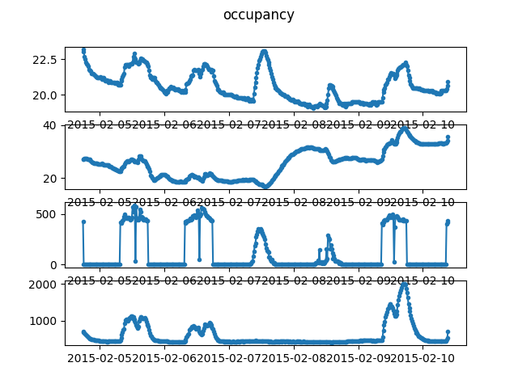

# Room occupancy data

Dataset on detecting room occupancy based on several variables. For our 
dataset we use the Temperature, Humidity, Light, and CO2 variables from the 
training dataset.

This dataset is obtained from the [UCI 
repository](https://archive.ics.uci.edu/ml/datasets/Occupancy+Detection+)
on 2019-06-10. As it is unclear whether the data can be redistributed as part 
of this repository, we download it locally instead.

The data is sampled at every 16 observations to reduce the length of the 
series.

When using this particular time series, please cite:

```bib
@article{candanedo2016accurate,
	title={Accurate occupancy detection of an office room from light, temperature, humidity and $\text{CO}_2$ measurements using statistical learning models},
	author={Candanedo, L. M. and Feldheim, V.},
	journal={Energy and Buildings},
	volume={112},
	pages={28--39},
	year={2016},
	publisher={Elsevier}
}
```


