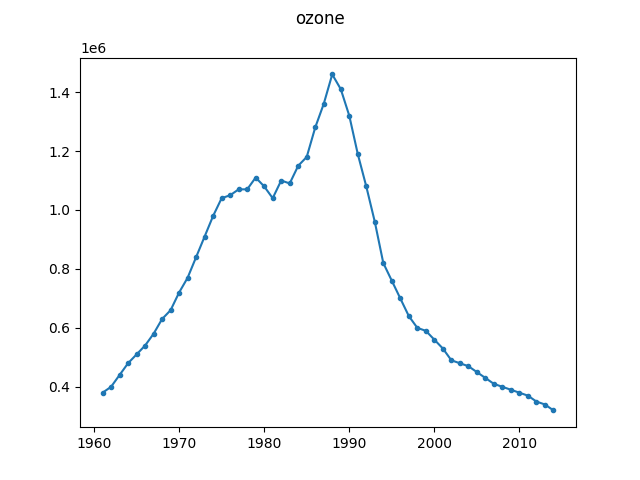

# Ozone-depleting substance emissions

This dataset contains "Global emissions of ozone-depleting substances, 
measured in tonnes of chlorofluorocarbon-11 equivalents
(CFC11-equivalents) per year." It is obtained from [Our World in 
Data](https://ourworldindata.org/ozone-layer), who have scraped the data from:

Hegglin, M. I., Fahey, D. W., McFarland, M., Montzka, S. A., & Nash, E. R. 
(2014). [Twenty questions and answers about the ozone layer: 2014 
update](https://www.wmo.int/pages/prog/arep/gaw/ozone_2014/documents/2014%20Twenty%20Questions_Final.pdf). 
World Meteorological Organization, UNEP, NOAA, NASA, and European Commission.

A change is expected after the signing of the [Montreal 
Protocol](https://en.wikipedia.org/wiki/Montreal_Protocol).

The chart in the article by [Our World in 
Data](https://ourworldindata.org/ozone-layer) is licensed under [CC BY 
4.0](https://creativecommons.org/licenses/by/4.0/deed.en_US). No changes to 
the data were made. The original data sourced from Hegglin et al., 2015 (cited 
above) is in the public domain.

The ``ozone.json`` file can be obtained from the original 
``./ozone-depleting-substance-emissions.csv`` by running:

```
$ python convert.py ./ozone-depleting-substance-emissions.csv ./ozone.json
```


