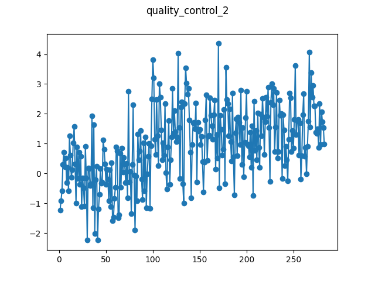

# Quality Control no. 2

This is a quality control dataset with a known change point at time index 97. 
The data has constant Gaussian (0, 1) noise throughout, with a step change of 
size 1.5. It exemplifies the kind of datasets used in simulation studies of CP 
algorithms.

