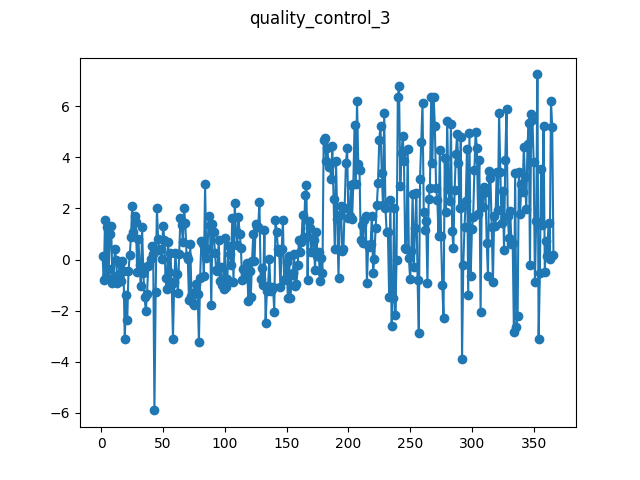

# Quality Control no. 3

This is a quality control dataset with a slight seasonal pattern and a known 
change point at time index 179. The change is a change in the Gaussian noise 
distribution from (0, 1) noise to (2, 2) noise. The data also contains an 
outlier at index 42 (indexing from 0).

