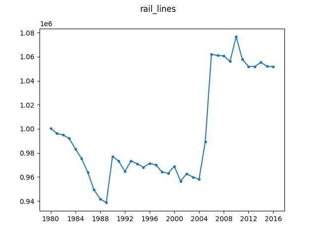

# Rail Lines (total route-km)

Data on the total kilometers of rail lines in the world. Data obtained from 
the [World 
Bank](https://data.worldbank.org/indicator/IS.RRS.TOTL.KM?locations=1W).

The dataset is licensed under [CC BY 
4.0](https://creativecommons.org/licenses/by/4.0/) and can therefore be 
redistributed as part of this repository. No modifications to the data have 
been made during the conversion to the JSON format.

- ``./API_IS.RRS.TOTL.KM_DS2_en_csv_v2_10520532.csv`` contains the original 
  dataset retrieved from the World Bank.
- ``./rail_lines.json`` contains the data from the entire world in JSON 
  format.

