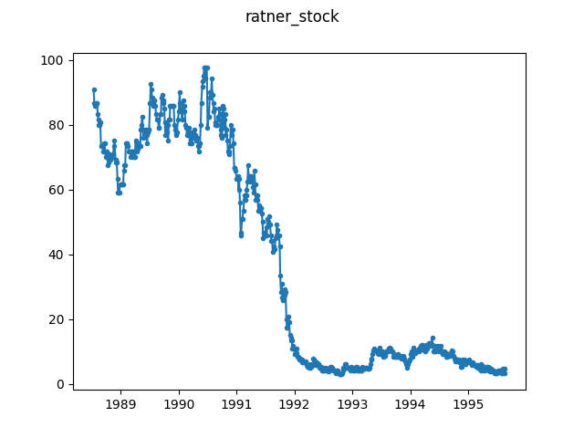

# Ratner Group Stock Price

The Ratner Group's stock price [is 
known](https://en.wikipedia.org/wiki/Gerald_Ratner#The_speech) for an event 
that can be considered a change point.

Historical stock market data for SIG retrieved from [Yahoo finance (daily 
frequency)](https://finance.yahoo.com/quote/SIG/history?period1=584841600&period2=1567036800&interval=1d&filter=history&frequency=1d). 
We use the Python package ``yfinance`` to download the data as it can not be 
redistributed as part of this repository.

The data has been sampled every 3 observations to reduce the length of the 
series.

Since the original data has observations only on trading days, there are 
arguably gaps in this time series (on non-trading days). However we consider 
these to be consecutive, and thus also consider the sampled time series to 
have consecutive observations.

