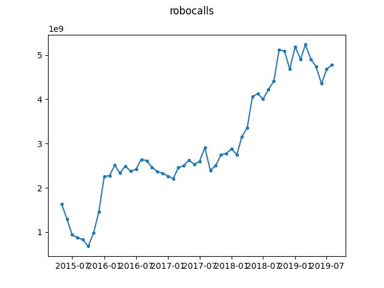

# Robocalls in the US per month

Data obtained from [RoboCallIndex](https://robocallindex.com/history/time). As 
it is not clear whether we can redistribute the data as part of this 
repository, we retrieve it locally instead.

There is a potential changepoint in March 2018 when the Federal Appeals Court 
struck down FCC rules on Robocalls. Full history of the relevant legislation 
can be found at 
[https://epic.org/amicus/tcpa/aca-international/](https://epic.org/amicus/tcpa/aca-international/).

