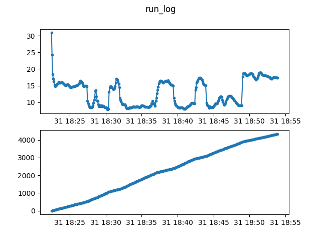

# Interval Training Running Pace

This dataset shows the pace of a runner during an interval training session, 
where a mobile application provides instructions on when to run and when to 
walk.

Data obtained from the authors' RunDouble account for a run on 2018-07-31.

See the LICENSE file for the license of the ``stats.csv`` file. To retrieve 
``run_log.json`` from ``stats.csv``, run:

```
$ python convert.py stats.csv run_log.json
```


