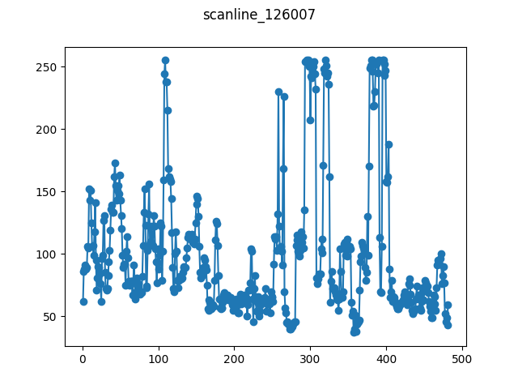

# Scan line of image 126007

This is a "scan line", a horizontal slice, from a grayscale image from the 
BSD300 dataset. The image and the exact index of the scan line have been 
selected because of the abrupt changes between black and white that occur.

As it is not clear whether the BSD300 images can be redistributed freely, we 
download the image from the internet archive instead.

