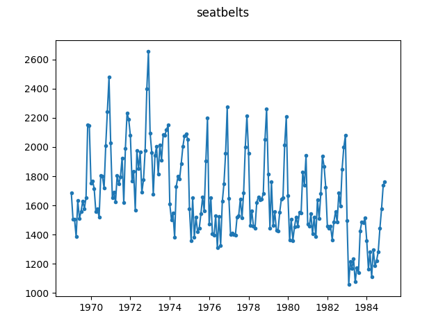

# UK Driver Deaths

This dataset concerns the number of drivers killed or seriously injured in the 
UK around the period where seatbelts are introduced. Seatbelts were compulsory 
equipment in all new cars in 1972 and were mandatory to be worn from 1983 
onwards.

Data exported from R, where the it is a builtin dataset called 
``UKDriverDeaths`` in the ``datasets`` package. Since the ``datasets`` package 
is part of R it is licensed under version 2 of the [GNU Public 
License](https://www.r-project.org/COPYING). The data file produced from this 
data (``seatbelts.json``) is therefore licensed under GPLv2 as well.

