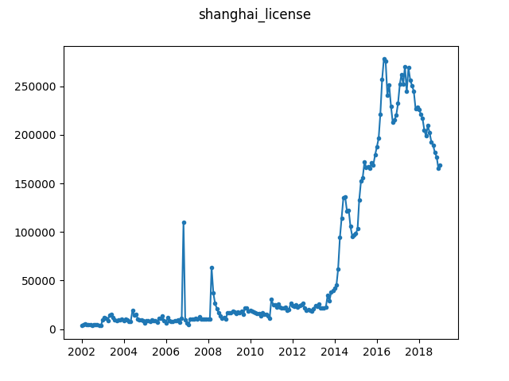

# Shanghai License Plate Applicants

Source: 
[Kaggle](https://www.kaggle.com/bogof666/shanghai-car-license-plate-auction-price). 
Data licensed under [CC0: Public 
Domain](https://creativecommons.org/publicdomain/zero/1.0/), so we can 
redistribute it as part of this repository.

There seems to be a clear sudden growth in the number of applicants.

Note: according to [this discussion on 
Kaggle](https://www.kaggle.com/bogof666/shanghai-car-license-plate-auction-price/discussion/73140), 
the record for 2008-02 is missing because the license plates for January and 
Feburary were auctioned off simultaneously in January. As this represents an 
uneven measurement and a missing value, we choose to split the observation for 
January and February 2008 in two, dividing the amount equally between the 
months. An alternative would be to introduce a missing value in 2008-02, but 
since many of the algorithms we wish to evaluate are not able to handle 
missing values (and any imputation method would be incorrect), we believe this 
is a reasonable way to deal with this issue.

To obtain the ``shanghai_license.json`` file from the 
``Shanghai_license_plate_price_-_Sheet3.csv`` file, simply run:

```
$ python convert.py Shanghai_license_plate_price_-_Sheet3.csv shanghai_license.json
```


