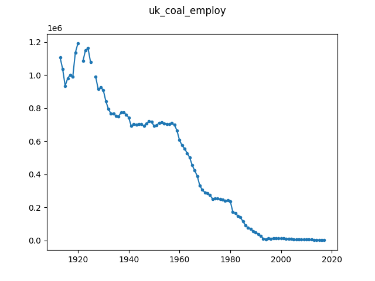

# Historic Employment in UK Coal Mines

This is historic data obtained from [the UK 
government](https://www.gov.uk/government/statistical-data-sets/historical-coal-data-coal-production-availability-and-consumption). 
As the dataset is licensed under the [Open Government 
License](https://www.nationalarchives.gov.uk/doc/open-government-licence/version/3/) 
we distribute it as part of this repository.

We use the employment column for the number of workers employed in the British 
coal mines (extracted to ``employ_only.csv`` from ``Coal_since_1853.xls``) and 
converted to the ``uk_coal_employ.json`` file. Missing values in the data are 
indicated by a ``null`` value in the JSON file.

