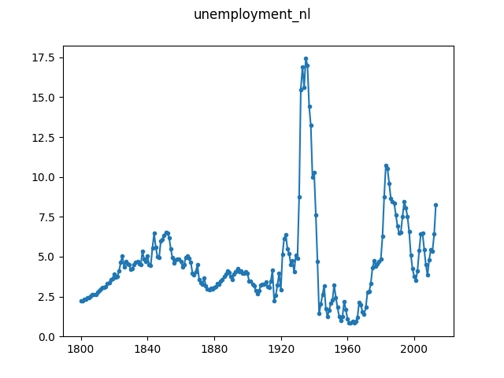

# Unemployment in the Netherlands

This data shows the percentage of unemployment people in the labor population. 
The original data is retrieved from [Statistics 
Netherlands](https://opendata.cbs.nl/statline/#/CBS/nl/dataset/71882ned/table?ts=1554392218500 
) and can be redistributed as part of this repository.

In the time series we use the data from both genders and use the corrected 
value for the year 2001.

To retrieve the ``unemployment_nl.json`` from the original source file, 
simply run:

```
$ python convert.py Beroepsbevolking__vanaf_1800__12_uursgrens___1800_2013_04042019_154346.csv unemployment_nl.json
```


