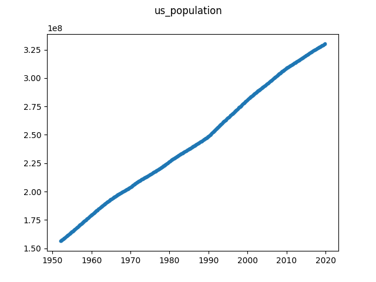

# US Population

This time series are the population numbers in the US. A potential change 
point occurs around index 459 (1990s).

Data obtained from
[Kaggle](https://www.kaggle.com/census/population-time-series-data#POP.csv).

The original source of the data is the US Census Bureau. According to [this 
page](https://web.archive.org/web/20191120160410/https://ask.census.gov/prweb/PRServletCustom/YACFBFye-rFIz_FoGtyvDRUGg1Uzu5Mn*/!STANDARD?pyActivity=pyMobileSnapStart&ArticleID=KCP-4726) 
on the US Census website, we are allowed to redistribute the data as part of 
this repository.

Source: United States Census Bureau, URL: https://www.census.gov, Retrieved: 
2019-08-28.

To obtain ``./us_population.json`` from ``POP.csv``, simply run:

```
$ python convert.py POP.csv us_population.json
```


