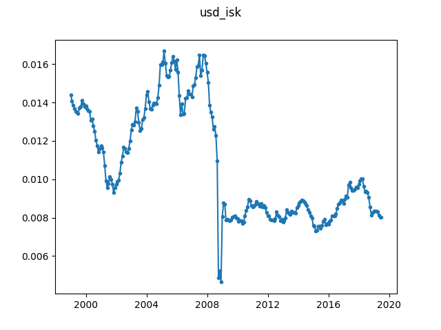

# USD - ISK exchange rate

Due to the financial crisis the USD/ISK exchange rate shows potential change 
point behaviour in the years around 2008. Since it is difficult to find freely 
available (and permissively licensed) historical exchange rate data, we 
instead use the monthly average Euro/ECU exchange rates of both USD and ISK 
and compute the USD/ISK rate from there.

The Euro/ECU exchange rate can be obtained from [this direct 
link](https://appsso.eurostat.ec.europa.eu/nui/show.do?query=BOOKMARK_DS-054904_QID_-3F48645A_UID_-3F171EB0&layout=TIME,C,X,0;CURRENCY,L,Y,0;UNIT,L,Z,0;STATINFO,L,Z,1;INDICATORS,C,Z,2;&zSelection=DS-054904UNIT,NAC;DS-054904INDICATORS,OBS_FLAG;DS-054904STATINFO,AVG;&rankName1=UNIT_1_2_-1_2&rankName2=INDICATORS_1_2_-1_2&rankName3=STATINFO_1_2_-1_2&rankName4=TIME_1_0_0_0&rankName5=CURRENCY_1_2_0_1&sortC=ASC_-1_FIRST&rStp=&cStp=&rDCh=&cDCh=&rDM=true&cDM=true&footnes=false&empty=false&wai=false&time_mode=NONE&time_most_recent=false&lang=EN&cfo=%23%23%23%2C%23%23%23.%23%23%23). 
The data is provided by Eurostat, and is Copyrighted to the European Union. 
Redistribution of the data in this repository is allowed according to [this 
copyright license](https://ec.europa.eu/eurostat/about/policies/copyright). No 
modification of the source data in ``ert_bil_eur_m_1_Data.csv`` has been made.

The conversion script expects the CSV file format, with the following 
configuration:

- Full extraction (check)
   + single file
- Flags and footnotes (check)
- Cell formatting
   + 1 234.56

This file is included in the repository as ``ert_bil_eur_m_1_Data.csv``. 
Additional metadata is stored in ``ert_bil_eur_m_Label.csv``. The file 
``usd_isk.json`` can be obtained from the original data by running:

```
$ python convert.py ert_bil_eur_m_1_Data.csv usd_isk.json
```


