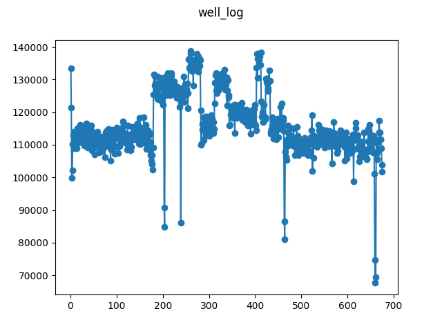

# Well-log dataset

This is the well-known well-log dataset used in many changepoint papers. This 
version is obtained from [this Github 
repository](https://raw.githubusercontent.com/alan-turing-institute/bocpdms/a4042b45004592f5b9fa912b346dd22a212b7ea0/Data/well.txt), 
and licensed under the MIT license.

The dataset is sampled at every 6 observations to reduce the length of the 
series. To obtain the json dataset from the original file, simply run:

```
$ python convert.py well_log.txt well_log.json
```

[Here](https://web.archive.org/web/20191128143944/https://raw.githubusercontent.com/alan-turing-institute/bocpdms/a4042b45004592f5b9fa912b346dd22a212b7ea0/Data/well.txt) 
is an archive.org url for the dataset.

When using this series, please cite the original source:

```bib
@book{oruanaidh1996numerical,
	title={Numerical {Bayesian} Methods Applied to Signal Processing},
	author={{\'O Ruanaidh}, J. J. K. and Fitzgerald, W. J.},
	year={1996},
	publisher={Springer}
}
```


